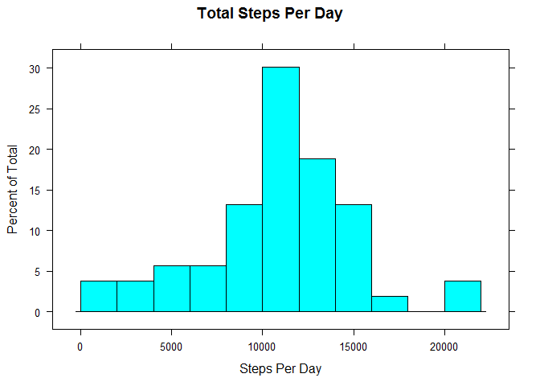
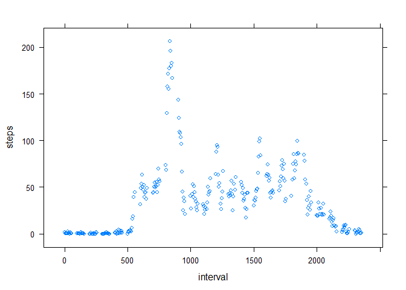
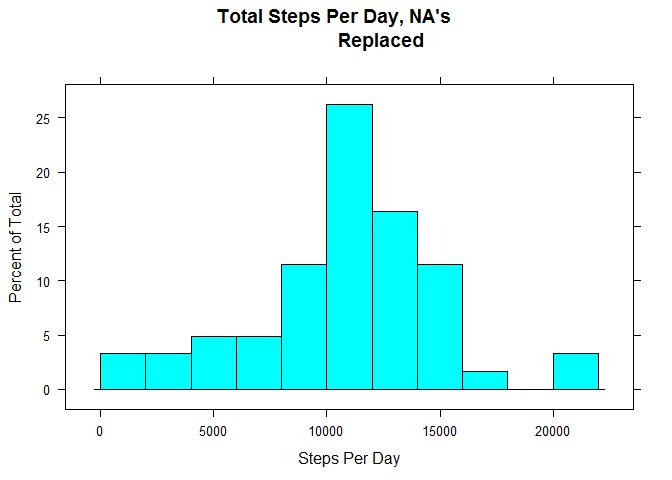
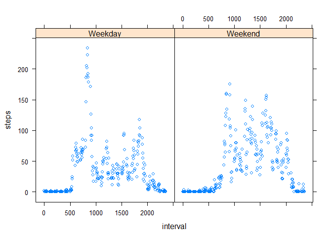

# Reproducible Research: Peer Assessment 1


## Loading and preprocessing the data
The data is available from the course Web site, and the following code is used to download it into the working directory and load it into a data frame:


```r
source<-"https://d396qusza40orc.cloudfront.net/repdata%2Fdata%2Factivity.zip"
download.file(url=source, destfile="trackerdata.zip")
rawdata<-read.csv(unz("trackerdata.zip", filename="activity.csv"))
```

Next, a set of analysis data is prepared from the raw data by
1. Create a function to calculate the day of week for each observation and whether that observation occurs on a weekday.
2. Create a new data frame using that dayofweek function.
3. Create a separate data frame with NA's removed.


```r
dayofweek<-function(source) {
         day<-weekdays(as.Date(source$date),abbreviate=FALSE)
         isweekday<-c()
         for (i in 1:length(day)){
                  if (day[i] == "Saturday" || day[i]=="Sunday") {
                           isweekday<-c(isweekday, "Weekend")
                  }
                  else {isweekday <- c(isweekday, "Weekday")}
                  }
         cbind(source, day, isweekday)
         }

analysisdata<-dayofweek(rawdata)
analysisdata$date<-as.Date(analysisdata$date)
analysisdataNAremoved<-analysisdata[complete.cases(analysisdata),]
```


## What is mean total number of steps taken per day?

The following code uses the lattice package to calculate the mean number of steps per day and present them in a histogram. It uses the data frame from which NA values have been removed.

The dplyr and lattice packages will be used here and in other steps, and so must be installed and loaded.


```r
library(dplyr)
```

```
## 
## Attaching package: 'dplyr'
```

```
## The following objects are masked from 'package:stats':
## 
##     filter, lag
```

```
## The following objects are masked from 'package:base':
## 
##     intersect, setdiff, setequal, union
```

```r
StepsPerDay<-summarize(group_by(analysisdataNAremoved, date), steps = sum(steps))
library(lattice)
RawStepsPerDayHist <- histogram( ~steps , data=StepsPerDay, xlab = "Steps Per Day",
                  main = "Total Steps Per Day", breaks = seq(from=0, to=22000,
                  by = 2000))
RawStepsPerDayHist
```

<!-- -->

The following code is used to calculate the mean and median number of steps per day:

```r
MeanStepsPerDay<- mean(StepsPerDay$steps)
MedianStepsPerDay<-median(StepsPerDay$steps)
```
- Mean number of steps per day: 1.0766189\times 10^{4}
- Median number of steps per day: 10765


## What is the average daily activity pattern?

Next, the assignment required one to consider the average number of steps taken per interval. The following code creates a separate data frame that summarizes the data by averaging the steps taken per interval, and then presents it in a time series plot:


```r
StepsPerInterval<-summarize(group_by(analysisdataNAremoved, interval), steps = mean(steps))

StepsPerIntervalPlot<-xyplot(steps ~ interval, data=StepsPerInterval)
StepsPerIntervalPlot
```

<!-- -->

##5: Interval with, on Average, the Most Steps Taken

The following code is used to determine which interval has, on average, the highest number of steps taken. This is done by resorting the StepsPerInterval data frame and taking the first record (i.e. with the highest value for steps): 

```r
MaxInterval<-StepsPerInterval[order(StepsPerInterval$steps, decreasing=TRUE),]
MaxInterval<-MaxInterval[1,]
```

On average, the most steps are observed in the following interval: 835, 206.1698113.

## Imputing missing values

Given the number of NA's observed in the data, the assignment asked us to develop a strategy for filling in missing data (i.e. the NA's). I elected to

1. Create a new data frame, NAfilled
2. Iterate through each row of the data frame. If an NA was found under steps,
3. Replace the NA with the average value for the corresponding interval, as determined in step #5, where I calculated the number of steps per interval.


```r
NAfilled<-analysisdata
for (i in 1:nrow(analysisdata)){
         temp<-c()
         if (is.na(analysisdata[i,1])) {
                  index<-match(NAfilled[i,4],StepsPerInterval$interval)
                  NAfilled[i,1]<-StepsPerInterval[index,2]    
         }
}
```

The following code plots a histogram of the average steps taken per day, using data where NA values have been filled:


```r
StepsPerDayNAFilled<-summarize(group_by(NAfilled, date), 
                               steps = sum(steps))

NAFilledStepsPerDayHist <- histogram( ~steps , data=StepsPerDayNAFilled, 
                  xlab = "Steps Per Day", main = "Total Steps Per Day, NA's 
                  Replaced", breaks = seq(from=0, to=22000,by = 2000))
NAFilledStepsPerDayHist
```

<!-- -->


## Are there differences in activity patterns between weekday and weekend
Finally, the assignment asked us to prepare a plot comparing the average steps per interval on weekdays and weekends. The following code does this by 
1. summarizing the analysis data to calculate the average steps taken in each interval on weekdays and on weekends.
2. Presenting a panel plot of the weekday and weekend values.


```r
StepsPerIntervalWeekday<-summarize(group_by(analysisdataNAremoved, interval, isweekday), steps = mean(steps))


CompareDaysPlot<-xyplot(steps ~ interval | isweekday, data=StepsPerIntervalWeekday)
CompareDaysPlot
```

<!-- -->

Interestingly, on weekdays we see
- A definite spike earlier in the day
- Lower activity throughout the day, with small spikes near midday and between mid-afternoon and early evening.

Weekends show more activity throuhgout the day, with activity increasing later in the morning and decreasing later in the evening than on weekends.

